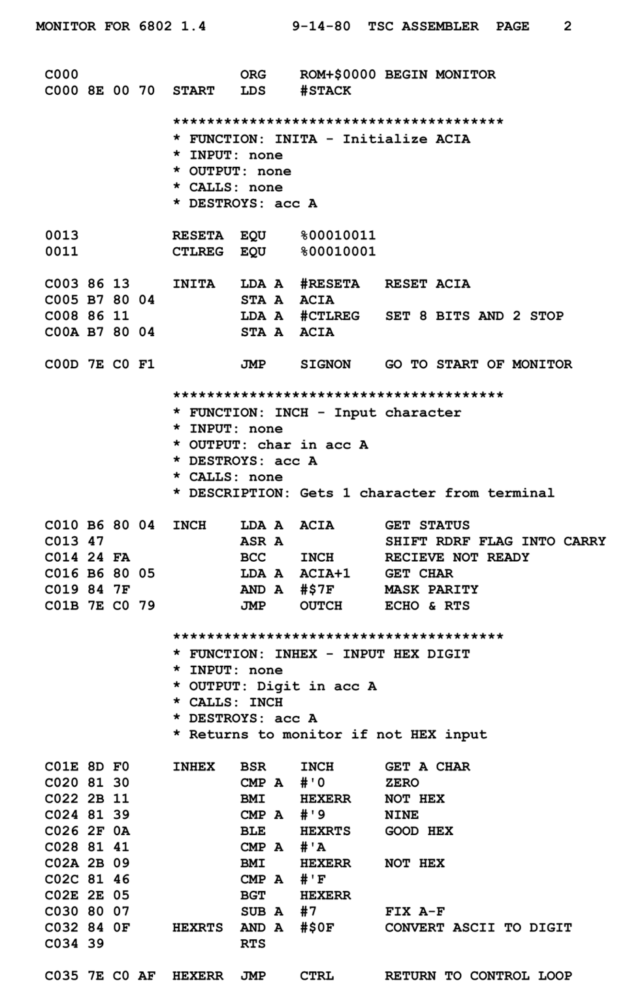

# 汇编语言 - 简介

汇编语言（Assembly Language）是计算机编程语言家族中最贴近硬件的一层，它是人类可读的机器指令助记符表示。

理解汇编语言的本质，是深入学习计算机系统的第一步。

---

## 什么是汇编语言

计算机的 CPU 只能理解和执行由 0 和 1 组成的二进制机器码。

例如，在 x86 架构中，机器码 `B8 2A 00 00 00` 表示将数值 42 移动到 EAX 寄存器。

直接编写二进制机器码对人类来说极其困难且容易出错，于是汇编语言应运而生。

汇编语言将这些二进制指令用人类可读的 助记符（Mnemonic） 来表示，例如上面的机器码在汇编中写作：

## 实例

```asm
mov eax, 42    ; 将数值 42 移动到 EAX 寄存器  
```

汇编器（Assembler）负责将这些助记符翻译回 CPU 可以执行的机器码。

上面例子中，`mov` 就是助记符，`eax` 是目标操作数，`42` 是源操作数。

汇编语言用助记符替代机器语言操作，支持标签、符号指代地址与常量，避免硬编码，汇编语言与对应机器语言指令集基本一一对应。



---

## 汇编语言与机器码的关系

汇编指令和机器指令之间存在 一一对应 的关系。

每一条汇编指令都精确映射到一条 CPU 机器指令，不存在中间抽象层。

| 形式        | 示例                                           | 说明           |
| --------- | -------------------------------------------- | ------------ |
| 机器码（二进制）  | 10111000 00101010 00000000 00000000 00000000 | CPU 直接执行的指令  |
| 机器码（十六进制） | B8 2A 00 00 00                               | 方便人类阅读的机器码表示 |
| 汇编语言      | mov eax, 42                                  | 人类可读的助记符表示   |

> 汇编语言和机器码是一一对应的，但不同架构的 CPU 有不同的指令集。例如 x86 和 ARM 的汇编语法完全不同。
---

## 汇编与高级语言的区别

下图展示了高级语言和汇编语言从源码到执行的不同路径：


| 特性   | 汇编语言          | 高级语言（如 Python）  |
| ---- | ------------- | --------------- |
| 抽象层级 | 最低级，直接操作硬件    | 高级，操作系统和运行时封装细节 |
| 代码量  | 简单功能需要大量代码    | 少量代码实现复杂功能      |
| 可读性  | 难以阅读和维护       | 人类友好，易于理解       |
| 执行效率 | 最高，无运行时开销     | 较低，有解释或编译开销     |
| 硬件控制 | 完全控制 CPU 和内存  | 通过抽象接口间接访问      |
| 可移植性 | 差，不同 CPU 需要重写 | 好，同一代码可在多平台运行   |

---

## 汇编语言的应用场景

汇编语言虽然不是日常开发的主流选择，但在特定领域仍然不可替代：

| 领域     | 具体应用                                |
| ------ | ----------------------------------- |
| 操作系统内核 | 启动引导（Bootloader）、上下文切换、中断处理等必须用汇编编写 |
| 嵌入式系统  | 资源极端受限的设备，需要精确控制硬件                  |
| 逆向工程   | 分析恶意软件、破解软件保护、理解闭源程序逻辑              |
| 性能敏感代码 | 加密算法、音视频编解码等对性能要求极高的核心函数            |
| 安全研究   | 编写 shellcode、漏洞利用代码                 |
| 编译器开发  | 理解目标代码生成，编写或优化编译器后端                 |

---

## x86 架构简介

x86 是 Intel 公司推出的微处理器架构，从 1978 年的 8086 处理器开始，经历了 80286、80386（i386）、80486、Pentium 等代发展。

x86 是最广泛使用的桌面和服务器 CPU 架构，也是学习汇编语言的理想平台。

本教程使用 32 位 x86 架构（也叫 IA-32 或 i386）作为教学基础，因为它的寄存器模型简洁清晰，适合入门。
> 32 位 x86 汇编是学习汇编语言的最佳起点。掌握了 32 位后，过渡到 64 位（x86-64）非常自然，因为后者是前者的扩展。
---

## NASM 汇编器简介

NASM（Netwide Assembler） 是一个开源的 x86 汇编器，支持多种输出格式和所有主流操作系统。

与 MASM（微软汇编器）和 GAS（GNU 汇编器）相比，NASM 的语法更加清晰直观，是学习汇编语言的最佳选择。

| 汇编器  | 语法风格     | 平台      | 特点              |
| ---- | -------- | ------- | --------------- |
| NASM | Intel 语法 | 跨平台     | 开源、语法清晰、文档完善    |
| MASM | Intel 语法 | Windows | 微软官方，功能强大但平台受限  |
| GAS  | AT&T 语法  | 跨平台     | GNU 工具链默认，语法反直觉 |

本教程全部使用 NASM 汇编器，语法采用 Intel 风格。
