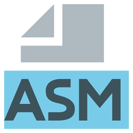

# 汇编语言 - 教程

汇编语言（Assembly Language）是一种面向特定硬件的低级语言。

汇编语言用于电子计算机、微处理器或微控制器编程。

汇编语言与机器指令集一一对应，不可跨平台移植。

与 C、Python 等高级语言不同，汇编语言直接操作 寄存器、内存地址 和 CPU 指令，没有任何抽象层的遮挡。

---

## 为什么要学汇编

学习汇编语言能让你真正理解计算机的底层工作原理。

以下是学习汇编的几个核心价值：

| 学习目标    | 说明                        |
| ------- | ------------------------- |
| 理解计算机底层 | 掌握 CPU、内存、寄存器如何协同工作       |
| 提升调试能力  | 能够阅读反汇编代码，定位底层 bug        |
| 性能优化    | 理解编译器生成的代码，写出更高效的高级语言程序   |
| 安全研究    | 逆向工程、漏洞分析、shellcode 编写的基础 |
| 嵌入式开发   | 资源受限设备上直接控制硬件             |

---

## 学习本教程前需要了解

学习本教程前，建议具备以下基础：

- 了解基本的计算机操作（文件管理、命令行使用）
- 了解任意一门高级编程语言的基本概念（变量、循环、函数）
- 了解二进制、十六进制的基本概念（非必需，教程中会讲解）

---

## 教程使用的工具

| 工具       | 用途                | 版本建议     |
| -------- | ----------------- | -------- |
| NASM     | 汇编器，将汇编源码转为目标文件   | 2.16 或更高 |
| GCC 或 LD | 链接器，将目标文件链接为可执行文件 | 任意版本     |
| GDB      | 调试器，单步执行和检查寄存器/内存 | 任意版本     |

> 本教程所有示例代码均在 Linux 环境下使用 NASM 汇编器编写和测试。
>
> 如果你使用 Windows，可以安装 WSL 或使用虚拟机来搭建 Linux 环境。
---

## 学习建议

逐一阅读每个章节，动手敲打并运行每个代码示例。

汇编语言的学习重在实践，只看不写是无法掌握的。

遇到不懂的概念可以放慢节奏，配合网上搜索加深理解。
> 汇编语言学习曲线较陡，但一旦理解，你对计算机的认知将发生质变。坚持下去，你会看到不一样的风景。
